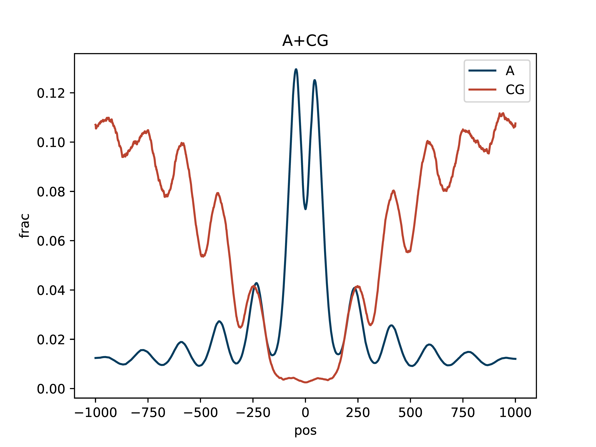
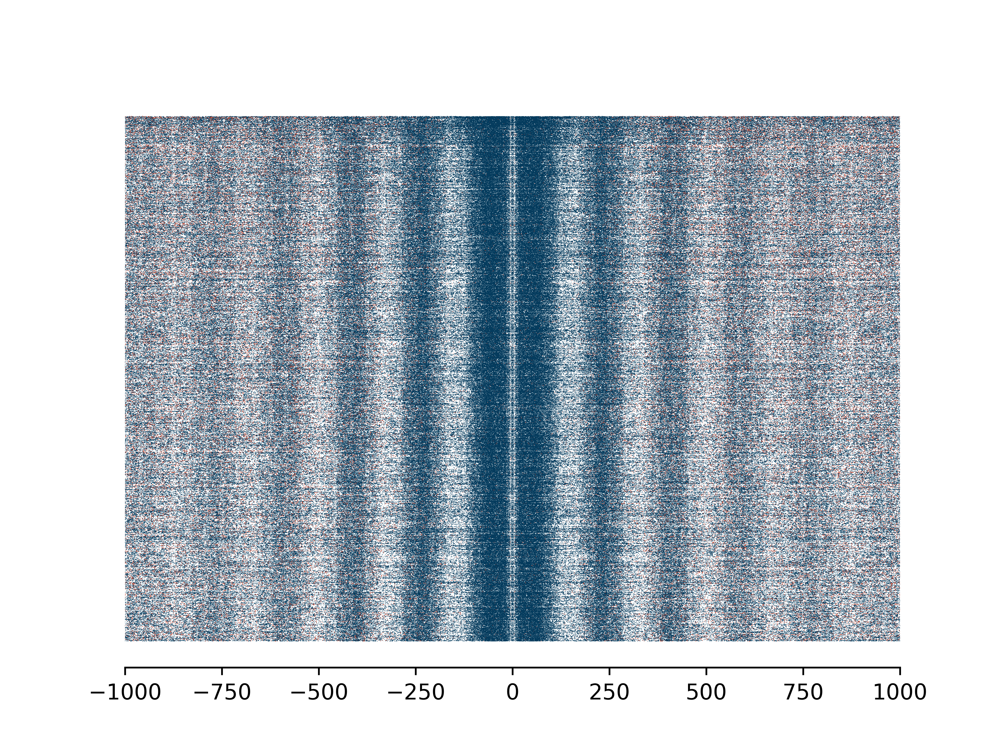
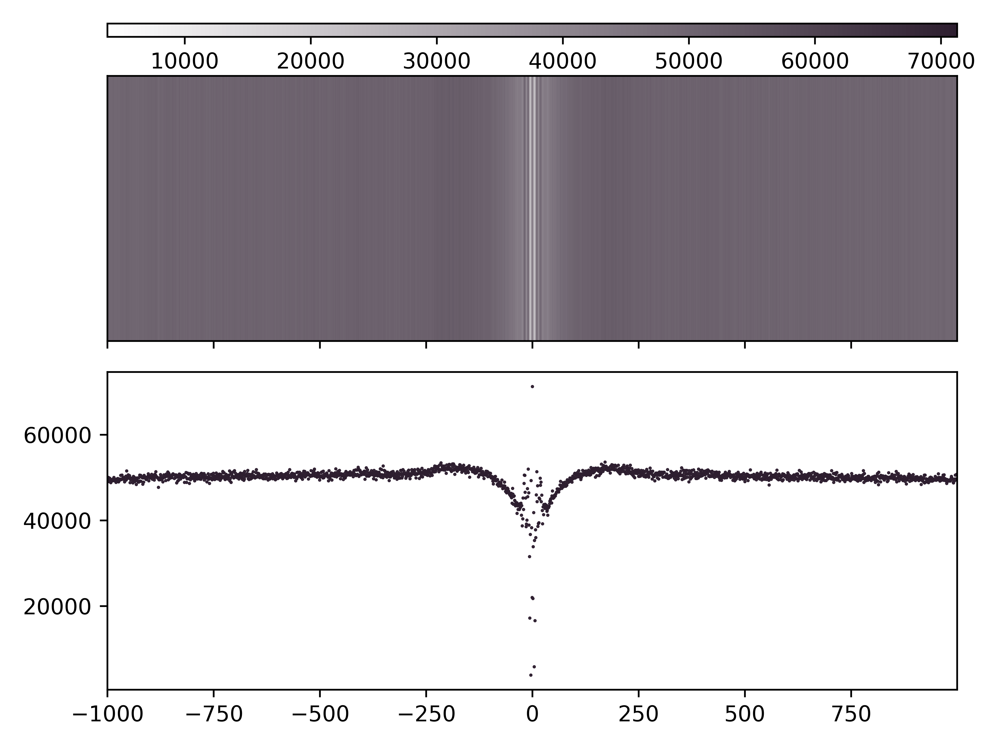
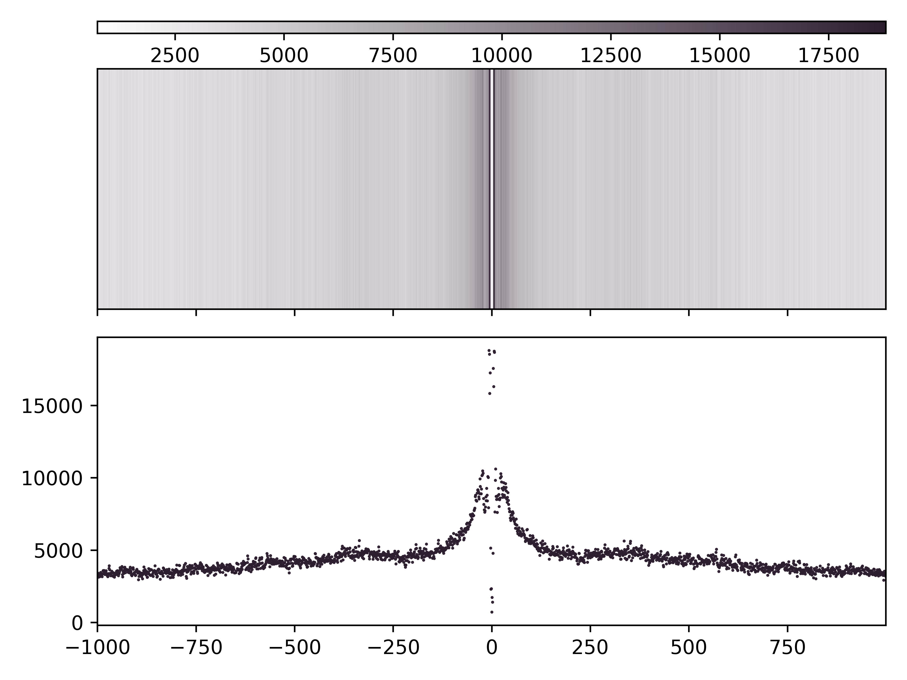

.. DO NOT EDIT.
.. THIS FILE WAS AUTOMATICALLY GENERATED BY SPHINX-GALLERY.
.. TO MAKE CHANGES, EDIT THE SOURCE PYTHON FILE:
.. "auto_examples/enrichment_profile_ma_mc_example.py"
.. LINE NUMBERS ARE GIVEN BELOW.

.. only:: html

    .. note::
        :class: sphx-glr-download-link-note

        Click :ref:`here <sphx_glr_download_auto_examples_enrichment_profile_ma_mc_example.py>`
        to download the full example code

.. rst-class:: sphx-glr-example-title

.. _sphx_glr_auto_examples_enrichment_profile_ma_mc_example.py:

Enrichment Profile mA & mCG
=================================

Aggregate and single molecule plots colored by modification and centered at regions of interest defined in bed file.

.. GENERATED FROM PYTHON SOURCE LINES 9-10

Create (1) aggregate profile plots for mA/A and mCG/CG, (2) single-molecule plots for mA + mCG, and (3) base abundance plots for A and CG.

.. GENERATED FROM PYTHON SOURCE LINES 12-14

1. Python option
----------------

.. GENERATED FROM PYTHON SOURCE LINES 14-32

.. code-block:: default

    import dimelo as dm

    bam = "deep_ctcf_mod_mappings_merge.sorted.bam"
    sampleName = "quartile4"
    bed = "quart4.bed"
    outDir = "./out"
    dm.plot_enrichment_profile(
        bam,
        sampleName,
        bed,
        "A+CG",
        outDir,
        threshA=190,
        threshC=190,
        dotsize=0.05,
    )

.. GENERATED FROM PYTHON SOURCE LINES 33-36

2. Command line option
----------------------
``dimelo-plot-enrichment-profile -f deep_ctcf_mod_mappings_merge.sorted.bam -s quartile4 -b quart4.bed -m A+CG -o ./out -A 190 -C 190 -d 0.05``

.. GENERATED FROM PYTHON SOURCE LINES 38-45

Output
----------------------

.. rst-class:: sphx-glr-timing

   **Total running time of the script:** ( 0 minutes  0.000 seconds)

.. _sphx_glr_download_auto_examples_enrichment_profile_ma_mc_example.py:

.. only :: html

 .. container:: sphx-glr-footer
    :class: sphx-glr-footer-example

  .. container:: sphx-glr-download sphx-glr-download-python

     :download:`Download Python source code: enrichment_profile_ma_mc_example.py <enrichment_profile_ma_mc_example.py>`

  .. container:: sphx-glr-download sphx-glr-download-jupyter

     :download:`Download Jupyter notebook: enrichment_profile_ma_mc_example.ipynb <enrichment_profile_ma_mc_example.ipynb>`

.. only:: html

 .. rst-class:: sphx-glr-signature

    `Gallery generated by Sphinx-Gallery <https://sphinx-gallery.github.io>`_
