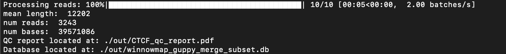
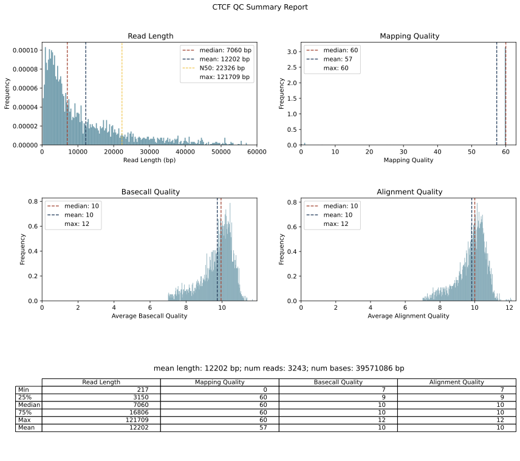

.. DO NOT EDIT.
.. THIS FILE WAS AUTOMATICALLY GENERATED BY SPHINX-GALLERY.
.. TO MAKE CHANGES, EDIT THE SOURCE PYTHON FILE:
.. "auto_examples/qc_report_example.py"
.. LINE NUMBERS ARE GIVEN BELOW.

.. only:: html

    .. note::
        :class: sphx-glr-download-link-note

        Click :ref:`here <sphx_glr_download_auto_examples_qc_report_example.py>`
        to download the full example code

.. rst-class:: sphx-glr-example-title

.. _sphx_glr_auto_examples_qc_report_example.py:

QC Report
===========================

Outputs quality control report from given bam files.

.. GENERATED FROM PYTHON SOURCE LINES 9-12

Usually as a first step after receiving bam files, we want to do a quality check
and assess our data. This code generates a PDF report of important QC statistics
for modified base data from Nanopore sequencing.

.. GENERATED FROM PYTHON SOURCE LINES 14-16

1. Python option
----------------

.. GENERATED FROM PYTHON SOURCE LINES 16-28

.. code-block:: default

    import dimelo as dm

    # first we specify the locations of our bam files
    bam = "winnowmap_guppy_merge_subset.bam"
    sampleName = "CTCF"
    outdir = "./out"

    # next we run the "qc_report" function
    dm.qc_report(bam, sampleName, outdir)
    # now our output directory will have a file called "CTCF_qc_report.pdf"

.. GENERATED FROM PYTHON SOURCE LINES 29-32

2. Command line option
----------------
``dimelo-qc-report -f winnowmap_guppy_merge_subset.bam -s CTCF -o ./out``

.. GENERATED FROM PYTHON SOURCE LINES 35-39

Output
----------------------

.. rst-class:: sphx-glr-timing

   **Total running time of the script:** ( 0 minutes  0.000 seconds)

.. _sphx_glr_download_auto_examples_qc_report_example.py:

.. only :: html

 .. container:: sphx-glr-footer
    :class: sphx-glr-footer-example

  .. container:: sphx-glr-download sphx-glr-download-python

     :download:`Download Python source code: qc_report_example.py <qc_report_example.py>`

  .. container:: sphx-glr-download sphx-glr-download-jupyter

     :download:`Download Jupyter notebook: qc_report_example.ipynb <qc_report_example.ipynb>`

.. only:: html

 .. rst-class:: sphx-glr-signature

    `Gallery generated by Sphinx-Gallery <https://sphinx-gallery.github.io>`_
