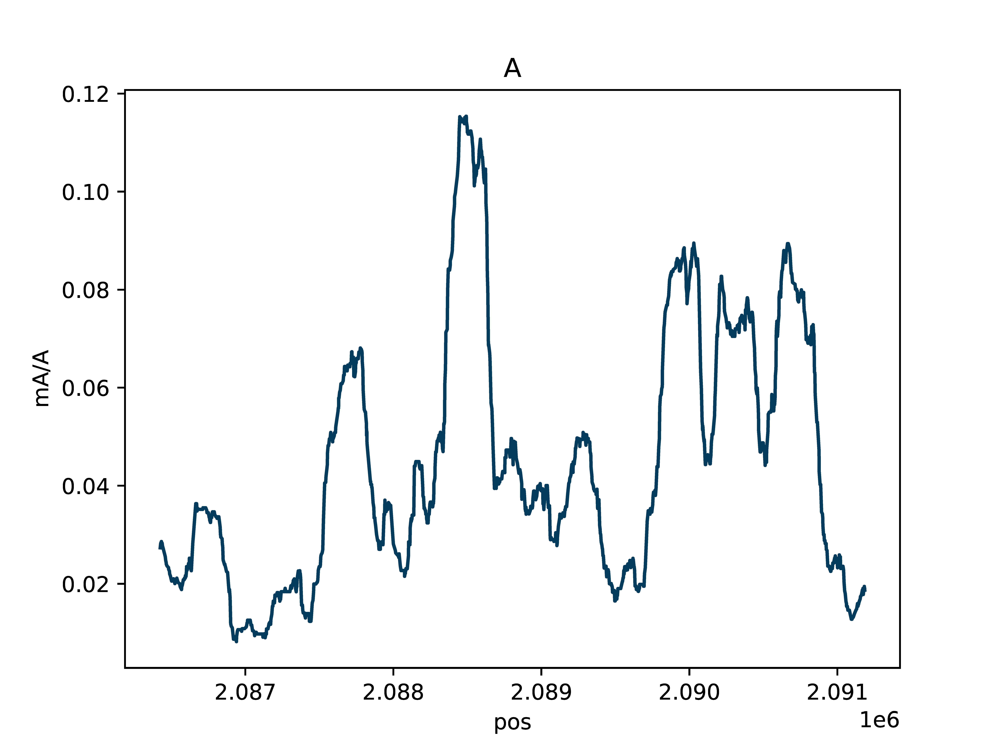

.. DO NOT EDIT.
.. THIS FILE WAS AUTOMATICALLY GENERATED BY SPHINX-GALLERY.
.. TO MAKE CHANGES, EDIT THE SOURCE PYTHON FILE:
.. "auto_examples/browser_example.py"
.. LINE NUMBERS ARE GIVEN BELOW.

.. only:: html

    .. note::
        :class: sphx-glr-download-link-note

        Click :ref:`here <sphx_glr_download_auto_examples_browser_example.py>`
        to download the full example code

.. rst-class:: sphx-glr-example-title

.. _sphx_glr_auto_examples_browser_example.py:

Single-Molecule Browser Plot
============================

Plot single molecules with colored base modifications in a region of interest

.. GENERATED FROM PYTHON SOURCE LINES 9-13

Create either an interactive single-molecule HTML browser if static=False, or create a PDF if static=True.
Base modifications are colored by type (mA vs. mCG) and probability of modification.
Example data for producing these plots can be downloaded from SRA: https://www.ncbi.nlm.nih.gov/bioproject/752170
The below Python and command line options produce the same output.

.. GENERATED FROM PYTHON SOURCE LINES 15-17

1. Python option
----------------

.. GENERATED FROM PYTHON SOURCE LINES 17-35

.. code-block:: default

    import dimelo as dm

    bam = "deep_ctcf_mod_mappings_merge.sorted.bam"
    sampleName = "CTCF"
    outDir = "./out"
    dm.plot_browser(
        bam,
        sampleName,
        "chr11:2086423-2091187",
        "A+CG",
        outDir,
        threshA=153,
        threshC=153,
        static=True,
        smooth=100,
        min_periods=10,
    )

.. GENERATED FROM PYTHON SOURCE LINES 36-39

2. Command line option
----------------------
``dimelo-plot-browser -f deep_ctcf_mod_mappings_merge.sorted.bam -s CTCF -r chr11:2086423-2091187 -m A+CG -o ./out -A 153 -C 153 --static -t 100 -n 10``

.. GENERATED FROM PYTHON SOURCE LINES 41-53

Output
----------------------
.. figure:: ../auto_examples/images/methylation_browser_chr11_2086423_2091187.png
    :align: center

.. figure:: ../auto_examples/images/CTCF_A_sm_rolling_avg_total.png
    :align: center
.. figure:: ../auto_examples/images/CTCF_C_sm_rolling_avg_fraction.png
    :align: center
.. figure:: ../auto_examples/images/CTCF_C_sm_rolling_avg_total.png
    :align: center

.. rst-class:: sphx-glr-timing

   **Total running time of the script:** ( 0 minutes  0.000 seconds)

.. _sphx_glr_download_auto_examples_browser_example.py:

.. only :: html

 .. container:: sphx-glr-footer
    :class: sphx-glr-footer-example

  .. container:: sphx-glr-download sphx-glr-download-python

     :download:`Download Python source code: browser_example.py <browser_example.py>`

  .. container:: sphx-glr-download sphx-glr-download-jupyter

     :download:`Download Jupyter notebook: browser_example.ipynb <browser_example.ipynb>`

.. only:: html

 .. rst-class:: sphx-glr-signature

    `Gallery generated by Sphinx-Gallery <https://sphinx-gallery.github.io>`_
